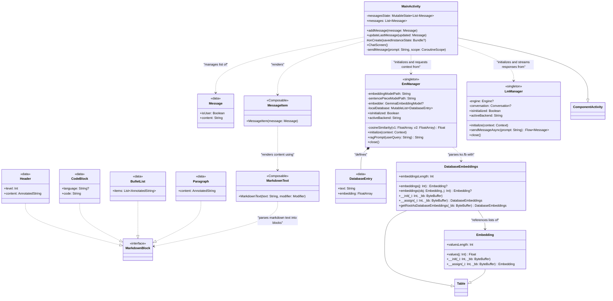
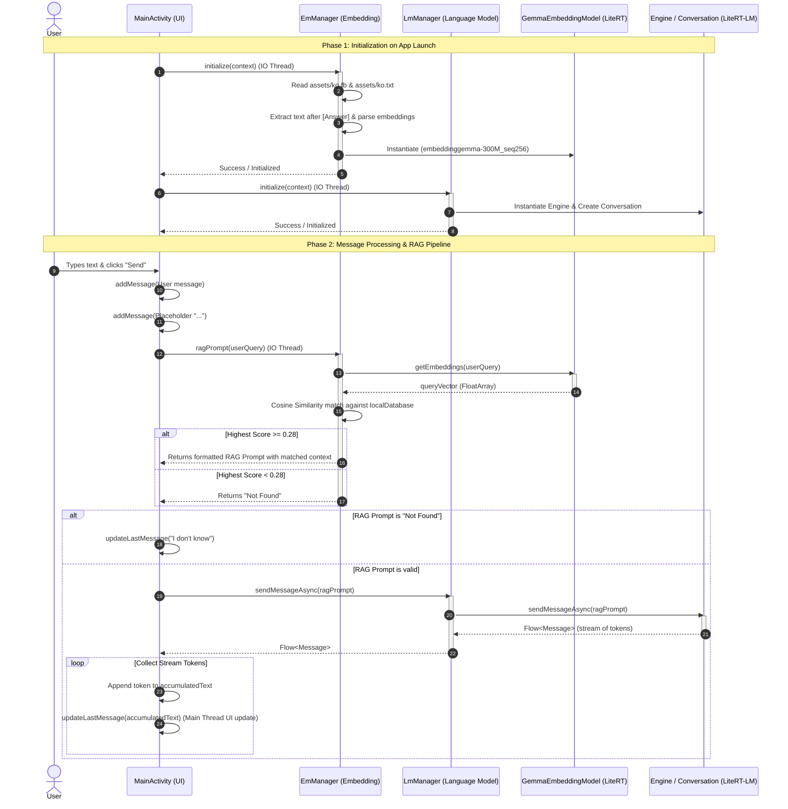

# UML Diagrams

This document outlines the architecture and execution flow of the Android application using UML class and sequence diagrams.

---

## 1. Class Diagram

The following class diagram shows the structure of the application, including UI components, singleton managers, FlatBuffers models, and their relationships.

---

## 2. Sequence Diagram

The following sequence diagram outlines the asynchronous communication and information flow during application initialization and message processing.

---

## 3. Class Components Overview

- **[MainActivity]**: The entry point and single activity of the Android application. It manages the Compose UI state, handles user text input, and initiates the RAG pipeline flow.
- **[EmManager]**: The local vector database manager. It handles memory-mapped loading of pre-calculated FlatBuffers embeddings (`ko.fb`) and answers (`ko.txt`), calculates similarity on the CPU, and manages the local query embedder.
- **[LmManager]**: The Language Model engine wrapper. It handles model initialization, local storage configurations, and manages model chats asynchronously via Flows.
- **[DatabaseEmbeddings]**: Generated FlatBuffers model classes used to read vectorized float arrays directly from asset memory.
- **[MarkdownText]**: Custom rendering utility that parses markdown syntaxes (headers, paragraphs, bold, code-blocks) to Jetpack Compose elements.
